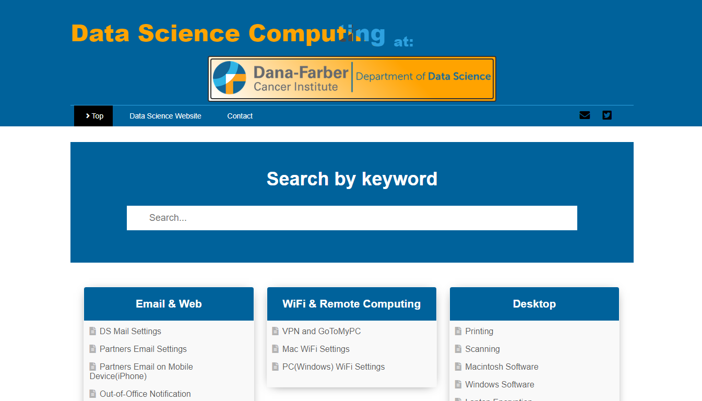

# DSDFCI DoDS

The DSDFCI website landing page.
 
[Live on gh-pages→](https://dsdfci.github.io/)

## Built with
The website landing page was built with the following tools:

- HTML5
- CSS3
- Javascript ES6

## Running Locally
To run the code locally, follow the following steps:

## Setup
Make a copy of the repository to a directory on your computer

- You can clone the repository by typing `git clone https://github.com/dsdfci/dsdfci.github.io.git` in the command line and hitting enter.
- Change directory by typing `cd dsdfci.github.io`.

### Prerequisites
You need the following setup on your computer to run the code.

- Code editor (Recommend VScode)
- Git (For version control)

### Installations
If you lack any of the above prerequisites, checkout the links below.

- [VScode](https://code.visualstudio.com/download) 
- [Git](https://git-scm.com/)

### Running Application
If you are using VScode code editor, then install the live server extension and it will run the code in real time and automatically show your changes in the browser as you make them.
To start the live server;

- Right click on the index.html and select `open with live server`

If it worked well, the the landing page should be automatically rendered in the browser on `http://127.0.0.1:5500/`.

## Author

👤 **Keith LaFace**

- Github: [@dsdfci](https://github.com/dsdfci)
- Email: [Keith LaFace](mailto:keith@ds.dfci.harvard.edu)

## 🤝 Contributing

Contributions, issues and feature requests are welcome!

- To create an issue, visit the [issues page](https://github.com/dsdfci/dsdfci.github.io/issues) and create a new issue.
- To contribute to the code base, follow the steps below:
  1. Fork this repository to your remote respository by clicking the Fork button in this repository.
  2. Clone this repository to a directory on your computer by following Github guidelines.
  3. Change directory into the directory where you cloned this repository to.
  4. Open the directory using your favorite editor.
  5. Create a feature branch off the develop branch.
  6. Make and commit the nuanced code.
  7. Open a pull request describing the improvements made and your reward awaits in heaven.

## 👍 Express your support

Give a ⭐️ if you like this project
